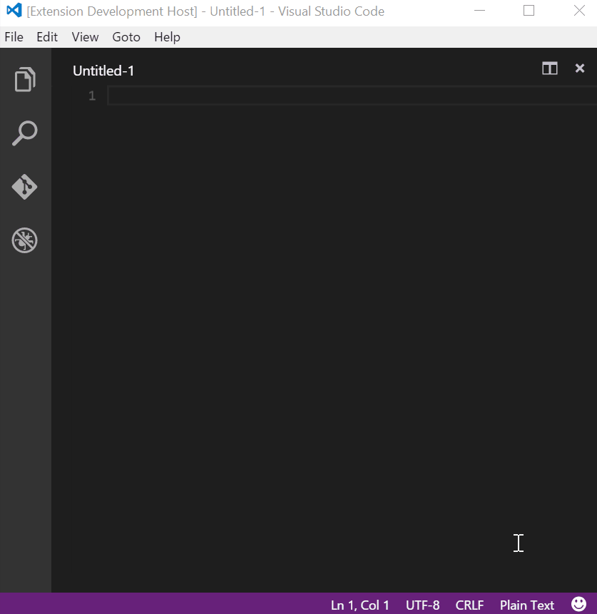
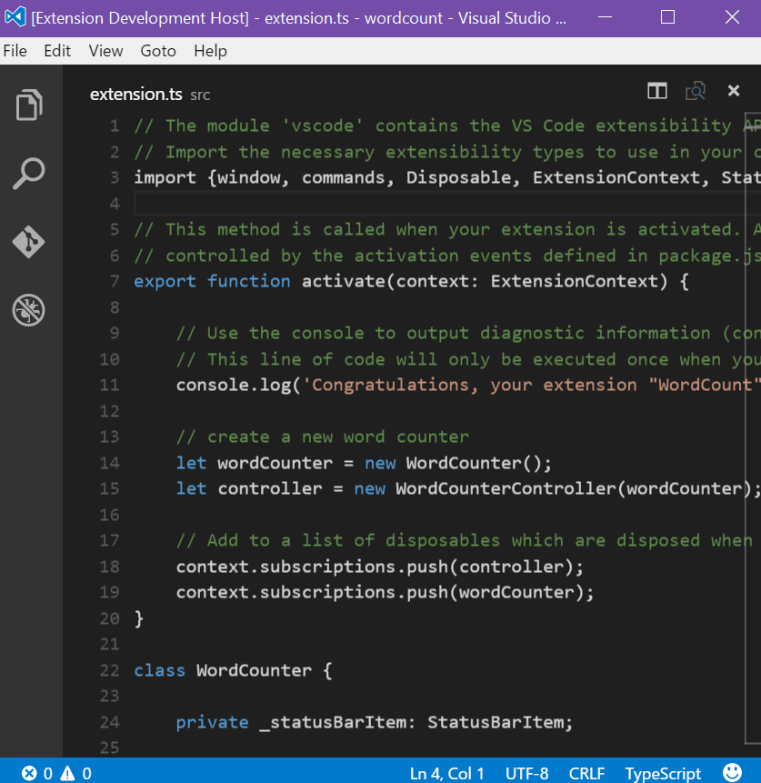

Visual Studio Code Slack extension
=========================


https://marketplace.visualstudio.com/items/sozercan.slack

This extension is not created by, affiliated with, or supported by Slack Technologies, Inc.

### Installation
You can install this extension by pressing F1 in Visual Studio Code, then typing "ex install" and selecting it from the list.

### Configuration
Go to User Settings (File > Preferences > User Settings) and add the following 
```
    	"slack.teamToken": "<your team token>",
        "slack.username": "<your username>",
        "slack.avatarUrl" : "<your avatar url>"
```

* ##### `"teamToken"` (required)
    * You can get the token from https://api.slack.com/docs/oauth-test-tokens

* ##### `"username"` (optional)
    * **defaults to "Code"**
    * Specified username will be attributed to each message

* ##### `"avatarUrl"` (optional)
    * Image for the avatar

### Features
* Send messages to
    * users
    * channels
    * private groups
* Can send message:
    * from selected code
    * from user input
* @user, #channel supported (at the beginning of message)
* Autofill last used channel/user/group
* Upload files
    * current open file
    * enter file path manually
    * selected text in open file
* Snooze notifications
    
### Upcoming features
* Multiple team support

### Shortcuts
* CTRL + ALT + N : Send new message
* CTRL + ALT + U : Send selection
* CTRL + ALT + J : Upload current file

### Feedback / Bug report / feature request
https://github.com/sozercan/vscode-slack/issues

#### Screenshots
* Send message



* Upload file


    
#### Credits
* Logo by [@chrisbernard](https://twitter.com/chrisbernard)
* Inspired by Simion's ST3 plugin: https://github.com/simion/sublime-slack-integration
